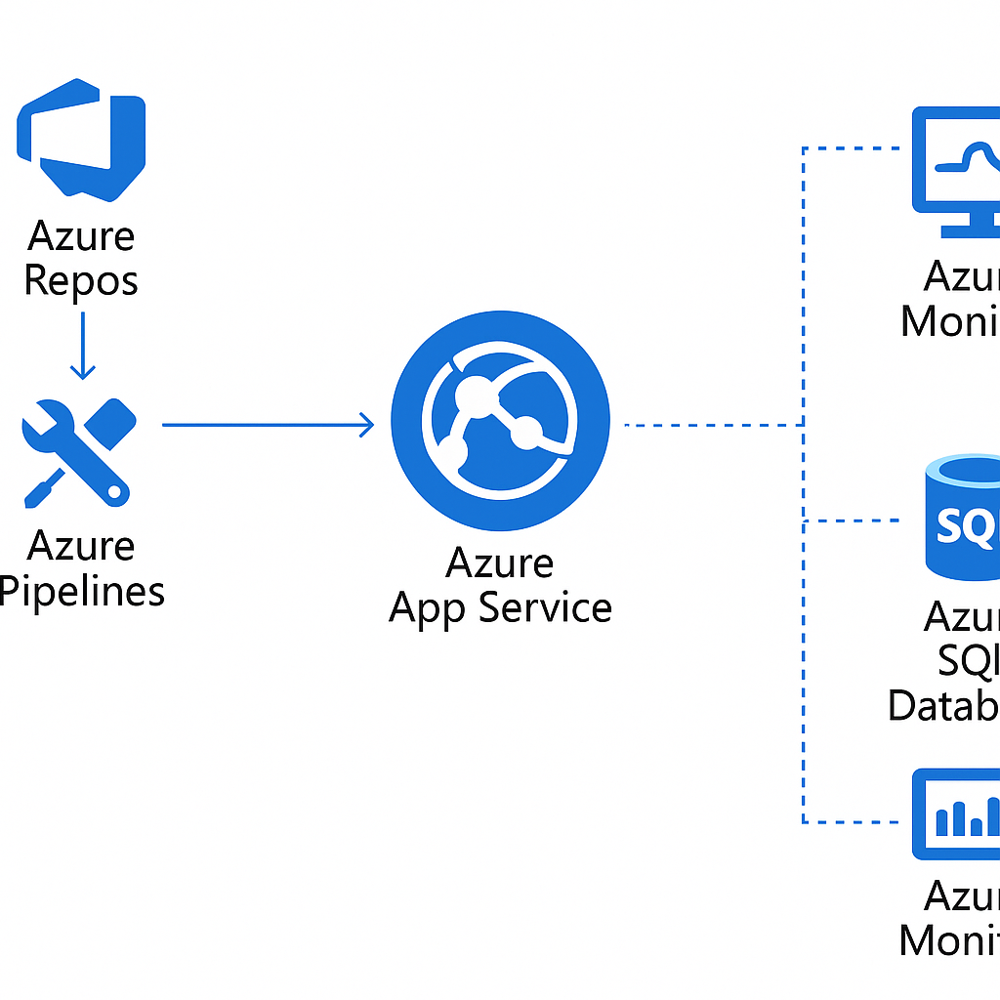
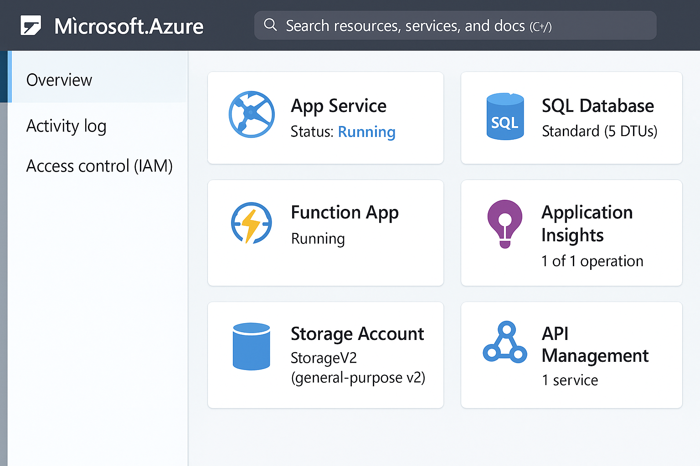

# Plataforma de Aplicações Microsoft 🚀💻

Projeto desenvolvido com base no desafio da DIO sobre a plataforma Microsoft para aplicações modernas na nuvem, com foco em CI/CD, segurança e monitoramento.

## 🔧 Arquitetura Proposta

## 🧱 Componentes da Solução

- **Azure Repos**: Gerenciamento de código-fonte
- **Azure Pipelines**: Integração e entrega contínua (CI/CD)
- **Azure App Service**: Hospedagem de aplicação web
- **Azure SQL Database**: Banco de dados relacional gerenciado
- **Azure Key Vault**: Armazenamento seguro de segredos e conexões
- **Azure Monitor**: Observabilidade e métricas da aplicação

## 📸 Print Simulado

## 📘 Aprendizados

Neste projeto, aprofundei conhecimentos sobre:
- Integração e entrega contínua no Azure
- Segurança e gerenciamento de segredos com Key Vault
- Monitoramento proativo com Azure Monitor
- Arquitetura de microsserviços na nuvem

---

> Projeto criado como parte do desafio prático da DIO: Microsoft Application Platform.
